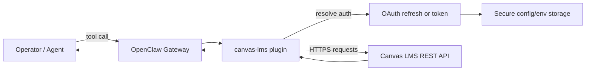

# openclaw-canvas-lms

Third-party Canvas LMS plugin for OpenClaw, maintained by Kansodata.

## Support and compatibility

- Maintainer: Kansodata.
- Distribution: npm package `@kansodata/openclaw-canvas-lms`.
- Expected runtime: Node 22+.
- OpenClaw compatibility target: `openclaw >= 2026.1.0` (see `peerDependencies`).

Architecture and security posture:

- Uses only public plugin APIs (`openclaw/plugin-sdk`), no internal `src/*` imports.
- Enforces HTTPS by default for Canvas endpoints and OAuth token exchange.
- Defaults to safer auth paths (OAuth or config/env token) and blocks inline token usage unless explicitly enabled.
- Applies bounded retries/timeouts and pagination limits to reduce abuse and runaway calls.
- Requires a configured Canvas base URL by default (per-call override is disabled unless explicitly enabled).

## Install

```bash
openclaw plugins install @kansodata/openclaw-canvas-lms --pin
```

## Enable

```bash
openclaw plugins enable canvas-lms
```

Package name: `@kansodata/openclaw-canvas-lms`  
Plugin id: `canvas-lms`

## Minimal config

```json
{
  "plugins": {
    "entries": {
      "canvas-lms": {
        "enabled": true,
        "config": {
          "baseUrl": "https://canvas.example.edu",
          "token": "<CANVAS_API_TOKEN>",
          "requestTimeoutMs": 20000,
          "maxRetries": 2
        }
      }
    }
  }
}
```

## Notes

- HTTPS is expected by default.
- Keep `allowInlineToken` disabled unless you explicitly need legacy behavior.
- Prefer OAuth with a Canvas Developer Key and minimum required scopes for multi-user deployments.
- Avoid reusing personal access tokens across multiple users or tenants.
- `sync_academic_digest` returns a digest payload; publication to Discord/Teams/WhatsApp/Telegram should be done by host automation/workflows.
- This plugin is designed to be maintained outside `openclaw/openclaw` and listed under community plugins.

## Risk controls

- Run `npm run verify` before each tag/release.
- Keep credentials out of source code and examples.
- Prefer OAuth2 for multi-user deployments.
- Use per-tenant/per-institution configuration boundaries.
- Review dependency updates and publish notes with each release.

## Architecture



## License

MIT
