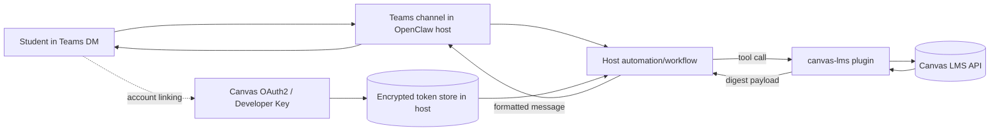

# Microsoft Teams Academic Chat (MVP) with Canvas LMS Plugin

## Objective

Provide an implementation guide for a **Teams DM-only** academic assistant that uses this plugin (`canvas-lms`) to read Canvas data and return digests/results.

## Non-objectives (MVP)

- Do not implement or modify the Teams channel in this repository.
- Do not publish directly from `sync_academic_digest`.
- Do not support group channels, multi-tenant cross-org routing, or broad admin workflows in MVP.

## Architecture (MVP)



## Identity flow (Teams user -> link -> Canvas OAuth)

1. Student starts a DM with the Teams bot.
2. Host app maps `teamsUserId` to an internal user record.
3. Host starts Canvas OAuth2 authorization (Developer Key + minimal scopes).
4. Host receives callback, exchanges code for tokens, stores tokens encrypted.
5. Host binds tokens to the specific `teamsUserId` and tenant boundary.
6. Future DM intents resolve with that user-scoped token context.

## MVP intents (5)

1. **Due today digest** (`sync_academic_digest` with `range=today`)
2. **Due this week digest** (`sync_academic_digest` with `range=week`)
3. **New announcements** (`list_announcements`)
4. **Calendar events** (`list_calendar_events`)
5. **Submission status / assignments** (`list_submissions`, `list_assignments`)

## Calling `sync_academic_digest`

Example tool call from host automation:

```json
{
  "tool": "canvas_lms",
  "args": {
    "action": "sync_academic_digest",
    "range": "today"
  }
}
```

Weekly version:

```json
{
  "tool": "canvas_lms",
  "args": {
    "action": "sync_academic_digest",
    "range": "week"
  }
}
```

The plugin returns digest data. The host should:

1. Parse and format the digest.
2. Apply channel-safe message formatting.
3. Send the final message to the user DM in Teams.

## Host publication model (Teams)

- `sync_academic_digest` returns data only.
- Delivery to Teams is performed by host-side automation/workflows.
- Keep this separation to preserve plugin scope and avoid channel coupling.

## Security recommendations (MVP baseline)

- **DM-only** at launch. Avoid Teams channels/groups in MVP.
- Prefer **OAuth2** over static tokens for multi-user deployments.
- Use **minimum scopes** required for selected intents.
- Store access/refresh tokens **encrypted at rest** in host infrastructure.
- Apply **tenant and user binding checks** before each Canvas call.
- Add **rate limiting** and retry/backoff limits in host workflows.
- Use **log redaction** for tokens, IDs, and sensitive payload fields.
- Keep a minimal **audit trail**: who requested, when, which action, result status.

## Threat model (short)

### Risks

- Token leakage in logs or misconfigured secret storage.
- User/tenant mix-up causing unauthorized data access.
- Prompt abuse causing excessive API calls.
- Channel escalation from DM to group exposure.

### Mitigations

- Encrypted token store + secret redaction.
- Strong user-to-token ownership checks.
- Request limits + bounded retries.
- Explicit policy: MVP is DM-only, no group posting.

## Implementation notes

- This repository provides Canvas integration and tools.
- Teams channel implementation and outbound posting are handled by OpenClaw host setup.
